# HairIT — platformă de programări la saloane


Aplicație full stack în care clienții găsesc saloane, frizerii și studiouri de înfrumusețare,
văd intervalele libere în timp real și rezervă din contul lor, iar proprietarii de saloane își
administrează agenda, serviciile și rezervările primite.

Frontend: **Angular 21** cu componente standalone, signals și rutare cu încărcare lazy.
Backend: **API REST Express** peste **SQLite**, cu autentificare pe sesiune și notificări în aplicație.
Toată interfața este scrisă de mână în CSS, fără framework de UI.

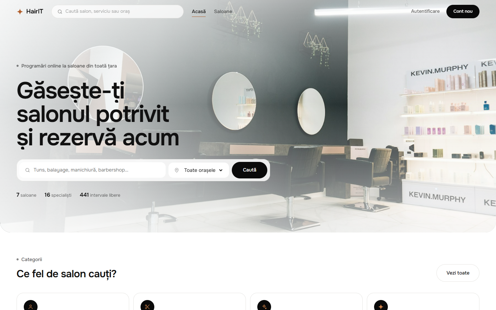

---

## Cuprins

- [Funcționalități](#funcționalități)
- [Conturi demo](#conturi-demo)
- [Capturi de ecran](#capturi-de-ecran)
- [Tehnologii](#tehnologii)
- [Structura proiectului](#structura-proiectului)
- [Modelul de date](#modelul-de-date)
- [Pornire rapidă](#pornire-rapidă)
- [API](#api)
- [Sistemul de design](#sistemul-de-design)
- [Cerințele temei și unde sunt implementate](#cerințele-temei-și-unde-sunt-implementate)
- [Scripturi disponibile](#scripturi-disponibile)
- [Publicare pe Vercel](#publicare-pe-vercel)

---

## Funcționalități

### Pentru clienți

- **Căutare** după oraș, categorie de salon sau text liber (nume de salon ori de serviciu);
- **Pagina salonului** cu servicii, prețuri, durate, echipă, program de lucru și recenzii;
- **Rezervare în trei pași** — alegi serviciul, specialistul (sau lași salonul să aleagă), apoi ziua și ora;
- intervalele libere sunt **verzi**, cele ocupate **roșii**, iar calendarul arată câte locuri rămân în fiecare zi;
- **rezumat lipit** pe lateral, cu serviciul, specialistul, data, ora și totalul de plată;
- **contul meu**: programări viitoare, istoric, anulare, saloane favorite și date personale;
- **notificări în aplicație** la confirmare, anulare și reprogramare, cu clopoțel și contor de necitite;
- **recenzii** cu punctaj de la 1 la 5, disponibile doar după o programare la salonul respectiv.

### Pentru saloane

- **îți adaugi salonul singur**, din formularul cu previzualizare live: nume, categorie, oraș, adresă,
  contact și fotografia de copertă; contul devine automat de tip proprietar;
- **panou propriu** cu cifrele salonului: rezervări viitoare, intervale libere, grad de ocupare, încasări estimate;
- **agenda zilei** pe fiecare specialist, cu datele de contact ale clientului și mențiunile lăsate de acesta;
- **anularea unei rezervări** din partea salonului, care trimite automat notificare clientului;
- **gestionarea serviciilor și a echipei**: adăugare, listare și ștergere, cu durată, preț și categorie;
- **program de lucru** editabil pe fiecare zi a săptămânii, cu zile marcate ca închise;
- **generarea intervalelor** din agendă pornind de la program și de la specialiști, cu pas configurabil;
  rularea repetată nu creează duplicate, iar rezervările existente rămân neatinse;
- un cont poate administra **mai multe saloane**, comutabile din același panou.

### Platformă

- autentificare pe email și parolă, cu parole hash-uite (scrypt) și sesiuni în cookie `httpOnly`;
- roluri separate pentru client și proprietar, cu gărzi de rută în Angular și verificări pe server;
- ecran de intrare animat, efect *liquid reveal* în hero, scroll fluid și animații la derulare;
- interfață responsive, navigare la tastatură și respectarea `prefers-reduced-motion`.

---

## Conturi demo

Baza de date este populată automat la prima pornire. Toate conturile au parola `parola123`.

| Rol | Email | Ce poate face |
| --- | --- | --- |
| Client | `ana@exemplu.ro` | rezervă, anulează, are favorite, recenzii și notificări |
| Client | `maria@exemplu.ro` | al doilea client, cu alt istoric |
| Proprietar | `owner@hairit.ro` | administrează **HairIT Studio** și **Barber Bros** |
| Proprietar | `contact@urbancut.ro` | administrează **Urban Cut** |

Pagina de autentificare are butoane care completează singure conturile demo.

---

## Capturi de ecran

| Ecran de intrare | Saloane recomandate |
| --- | --- |
|  | 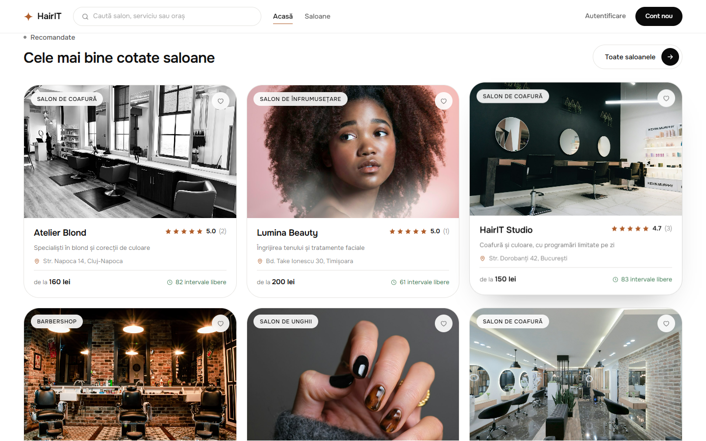 |

| Căutare cu filtre | Pagina salonului |
| --- | --- |
| 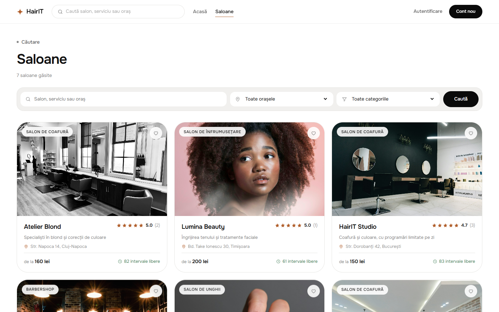 | 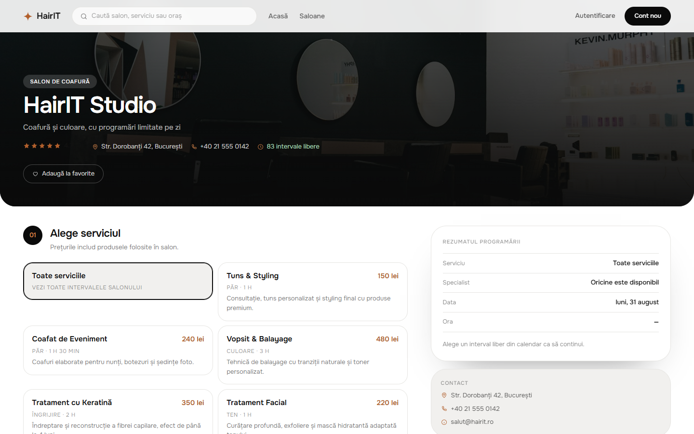 |

| Flux de rezervare | Rezumatul programării |
| --- | --- |
| 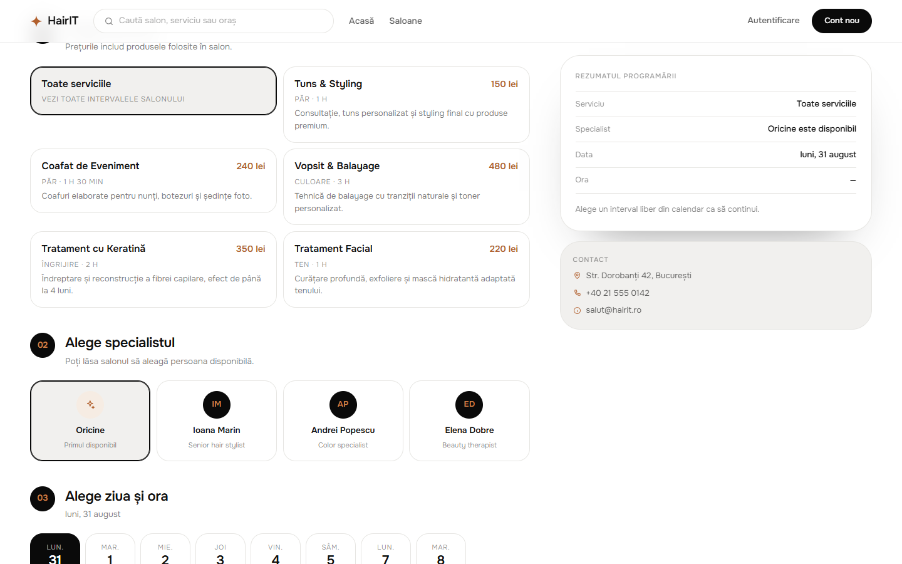 | 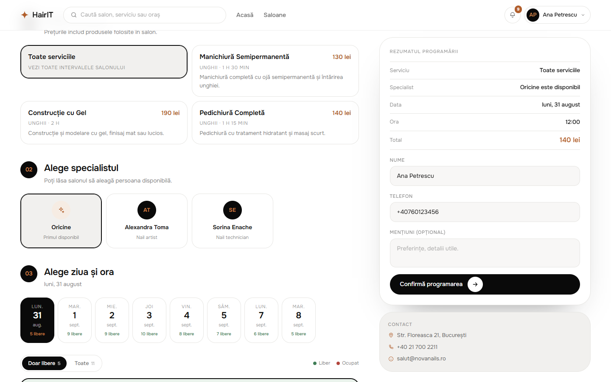 |

| Confirmare | Contul meu |
| --- | --- |
| 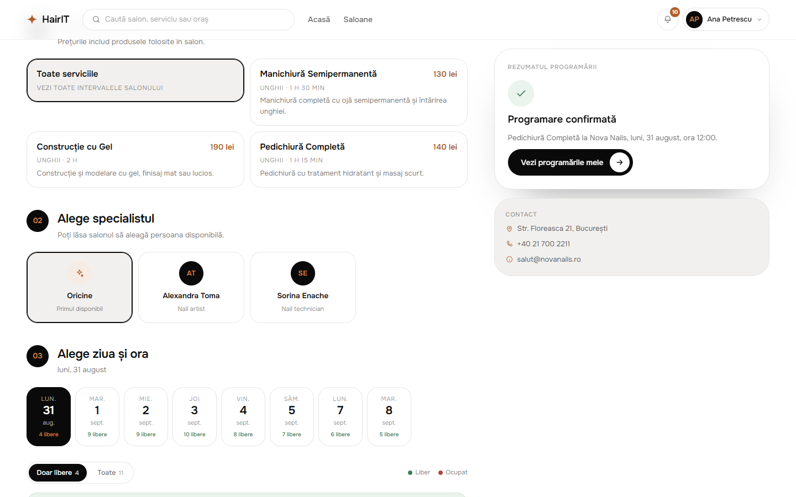 | 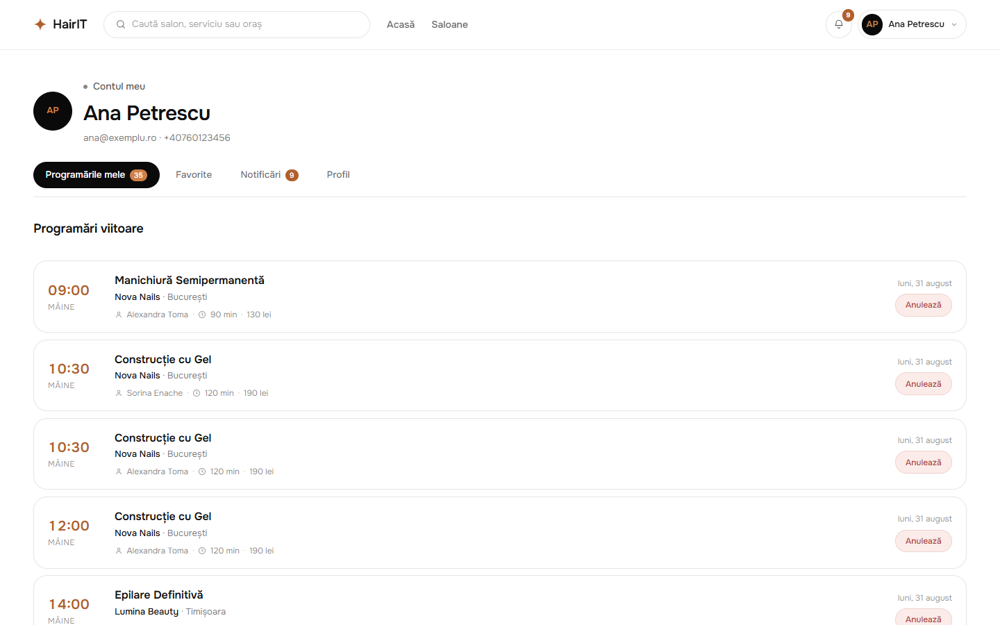 |

| Notificări | Autentificare |
| --- | --- |
| 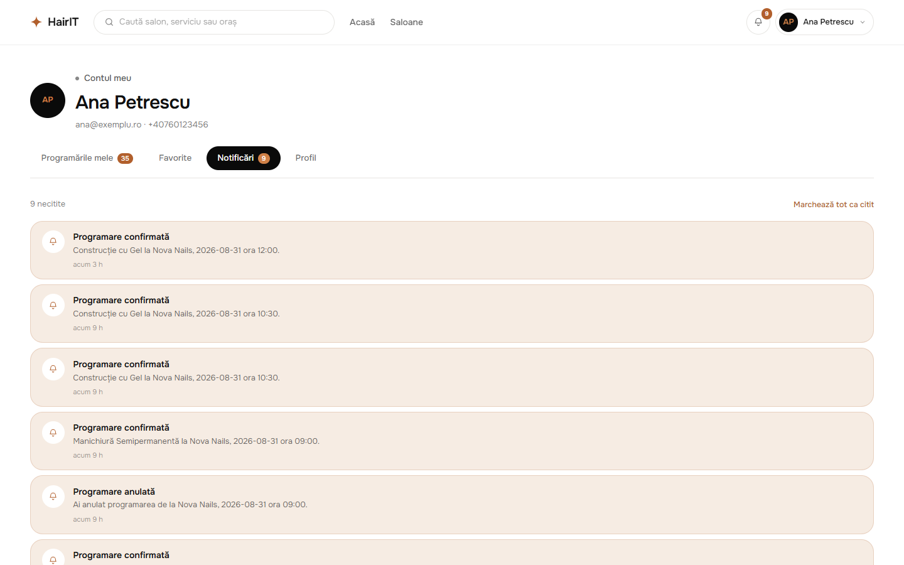 | 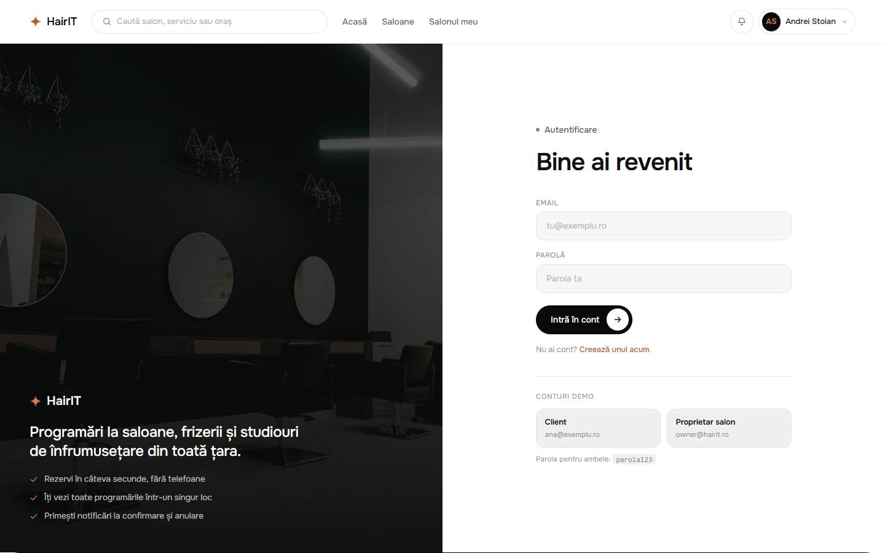 |

| Panoul salonului | Agenda zilei |
| --- | --- |
| 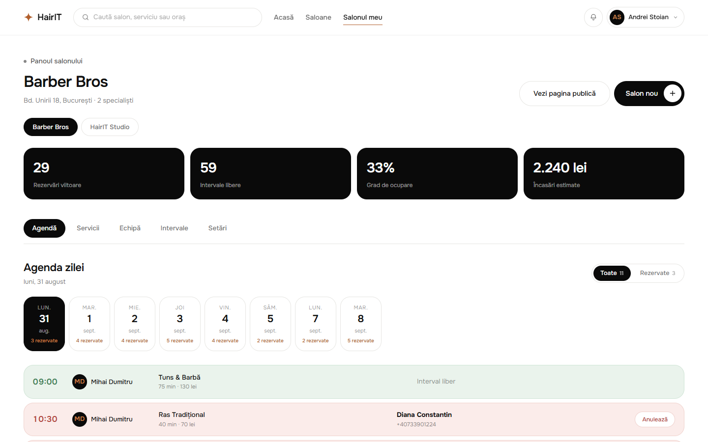 | 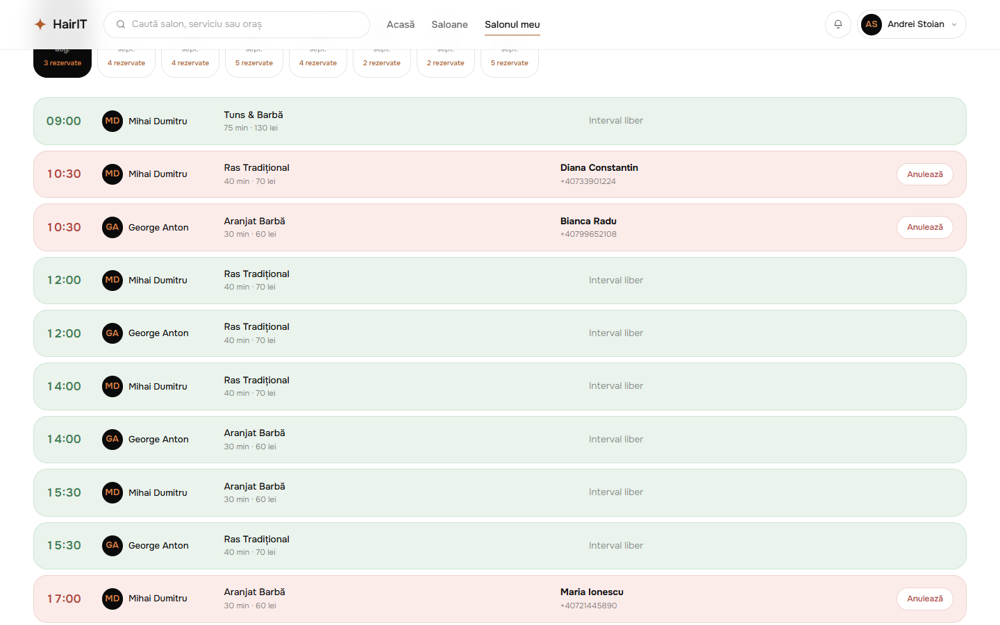 |

| Adaugă-ți salonul | Generarea intervalelor |
| --- | --- |
| 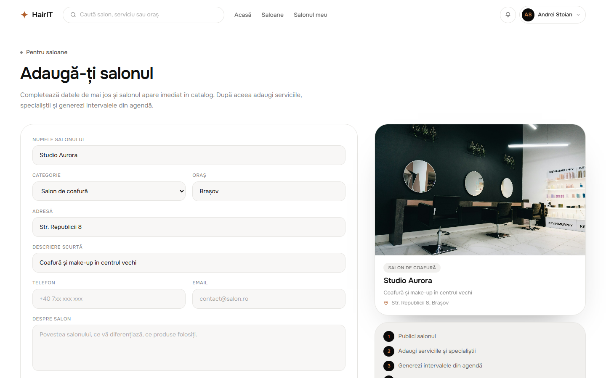 | 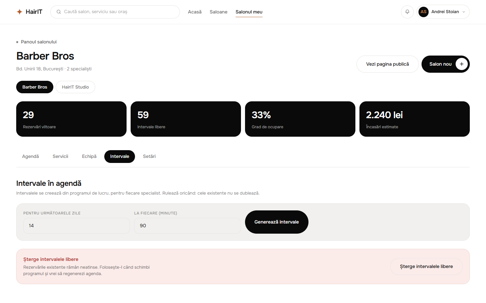 |

| Mobil — acasă | Mobil — căutare |
| --- | --- |
| 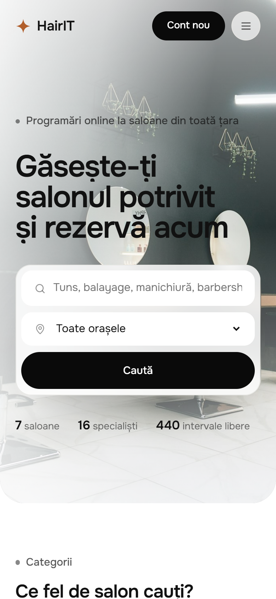 | 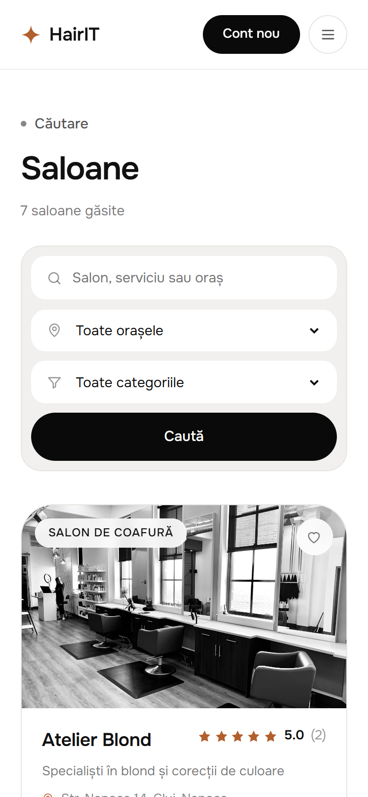 |

Capturile se regenerează cu `npm run screenshots` (necesită Chrome sau Edge instalat,
plus backend-ul și frontend-ul pornite).

---

## Tehnologii

| Zonă | Tehnologii |
| --- | --- |
| Frontend | Angular 21 (standalone, signals, zoneless), Router cu lazy loading, Reactive Forms, TypeScript 5.9, CSS pur, Lenis |
| Backend | Node.js 24, Express 4, `node:sqlite` local și `@libsql/client` (Turso) în producție |
| Securitate | scrypt pentru parole, sesiuni opace în baza de date, cookie `httpOnly` + `SameSite=Lax` |
| Găzduire | Vercel — frontend static + API ca funcție serverless |
| Unelte | Angular CLI, Puppeteer (capturi de ecran), PowerShell / zip (arhiva de predare) |

Nu există dependențe de UI kit-uri sau framework-uri CSS: tot sistemul de design este scris de mână.

---

## Structura proiectului

```
HairIT/
├── backend/                        API REST + baza de date
│   └── src/
│       ├── lib/
│       │   ├── db.js               driverele SQLite (local si Turso)
│       │   ├── schema.js           definitia tabelelor
│       │   ├── auth.js             parole, sesiuni, cookie-uri, middleware
│       │   ├── route.js            validare si tratarea erorilor async
│       │   └── repositories/       users, salons, appointments, reviews, notifications
│       ├── routes/                 auth, salons, appointments, me, owner
│       ├── seed.js                 7 saloane, 25 servicii, conturi demo
│       ├── app.js                  configurarea Express
│       └── server.js               punctul de pornire local
├── frontend/                       aplicatia Angular
│   ├── public/images/              fotografiile saloanelor
│   └── src/app/
│       ├── core/
│       │   ├── models/             interfetele TypeScript
│       │   ├── guards/             authGuard si ownerGuard
│       │   ├── services/           Api, AuthStore, SalonStore, AccountStore, OwnerStore
│       │   └── utils/              formatarea datelor si a preturilor
│       ├── shared/                 icon, rating, avatar, salon-card, empty-state,
│       │                           auth-shell, reveal, liquid-reveal
│       ├── layout/                 page-loader, site-header, nav-menu, site-footer
│       ├── pages/                  home, salons, salon, login, register,
│       │                           account, new-salon, owner, not-found
│       ├── app.routes.ts           rutele si garzile
│       └── styles.css              sistemul de design global
├── api/index.js                    functia serverless de pe Vercel
├── vercel.json                     build-ul si rutarea /api
├── docs/screenshots/               capturile din acest README
└── tools/                          generarea capturilor si arhiva de predare
```

---

## Modelul de date

| Tabel | Rol |
| --- | --- |
| `users` | conturi de client și de proprietar, cu parola hash-uită |
| `sessions` | sesiuni active, identificate prin hash-ul token-ului din cookie |
| `salons` | saloanele din platformă, fiecare legat opțional de un proprietar |
| `salon_hours` | programul de lucru pe zile ale săptămânii |
| `staff` | specialiștii fiecărui salon |
| `services` | serviciile, cu durată, preț și categorie |
| `appointments` | intervalele din agendă, libere sau rezervate |
| `reviews` | câte o recenzie de utilizator per salon |
| `favorites` | saloanele salvate de utilizatori |
| `notifications` | mesajele afișate în clopoțelul din header |

Intervalele sunt generate în avans pentru fiecare specialist și zi lucrătoare, iar rezervarea doar
schimbă statusul din `available` în `booked` și atașează utilizatorul.

---

## Pornire rapidă

Ai nevoie de **Node.js 22.12+ sau 24+**.

```bash
npm run setup
```

Pornește API-ul într-un terminal:

```bash
npm run api
```

Și aplicația Angular în alt terminal:

```bash
npm run web
```

- interfața: <http://localhost:4200>
- API: <http://localhost:3100/api>

Baza de date SQLite se creează și se populează automat la prima pornire, în `backend/data/hairit.db`.
Nu ai nevoie de niciun cont sau variabilă de mediu pentru dezvoltare. Pentru a regenera datele:

```bash
npm run seed
```

---

## API

Toate rutele sunt sub prefixul `/api`. Rutele marcate cu 🔒 cer sesiune activă.

### Autentificare

| Metodă | Rută | Descriere |
| --- | --- | --- |
| `POST` | `/auth/register` | cont nou (`fullName`, `email`, `phone`, `password`, `role`) |
| `POST` | `/auth/login` | autentificare, setează cookie-ul de sesiune |
| `POST` | `/auth/logout` | închide sesiunea |
| `GET` | `/auth/me` | utilizatorul curent |
| `PATCH` | `/auth/me` 🔒 | actualizează numele și telefonul |
| `POST` | `/auth/me/password` 🔒 | schimbă parola și invalidează sesiunile |

### Catalog

| Metodă | Rută | Descriere |
| --- | --- | --- |
| `GET` | `/salons` | listă cu filtre `city`, `category`, `q` |
| `GET` | `/salons/filters` | orașe, categorii și cifrele platformei |
| `GET` | `/salons/:slug` | salonul complet: servicii, echipă, program, recenzii |
| `GET` | `/salons/:slug/days` | zilele cu intervale, filtrabile pe serviciu și specialist |
| `GET` | `/salons/:slug/slots` | intervalele unei zile |
| `GET` | `/salons/:slug/reviews` | recenziile salonului |

### Programări

| Metodă | Rută | Descriere |
| --- | --- | --- |
| `GET` | `/appointments/:id` | o programare |
| `POST` | `/appointments/:id/reserve` 🔒 | rezervă intervalul și notifică utilizatorul |
| `POST` | `/appointments/:id/cancel` 🔒 | anulează (clientul propriu sau proprietarul salonului) |
| `POST` | `/appointments/:id/reschedule` 🔒 | mută rezervarea pe alt interval liber |

### Contul meu 🔒

| Metodă | Rută | Descriere |
| --- | --- | --- |
| `GET` | `/me/appointments` | programări viitoare și istoric |
| `GET` | `/me/favorites` | saloanele favorite |
| `POST` / `DELETE` | `/me/favorites/:salonId` | adaugă sau scoate de la favorite |
| `GET` | `/me/notifications` | notificările și numărul de necitite |
| `POST` | `/me/notifications/:id/read` | marchează una ca citită |
| `POST` | `/me/notifications/read-all` | marchează toate ca citite |
| `PUT` / `DELETE` | `/me/reviews/:slug` | salvează sau șterge recenzia proprie |

### Panoul salonului 🔒 (rol `owner`)

| Metodă | Rută | Descriere |
| --- | --- | --- |
| `POST` | `/owner/salons` 🔒 | adaugă un salon nou; contul devine proprietar (nu cere rolul dinainte) |
| `GET` | `/owner/salons` | saloanele administrate |
| `GET` | `/owner/salons/:id` | detalii, servicii, echipă, program și statistici |
| `PATCH` | `/owner/salons/:id` | actualizează datele salonului |
| `PUT` | `/owner/salons/:id/hours` | salvează programul de lucru (șapte zile) |
| `GET` | `/owner/salons/:id/agenda` | agenda unei zile, plus zilele disponibile |
| `POST` | `/owner/salons/:id/slots` | generează intervalele libere (`days`, `stepMin`) |
| `DELETE` | `/owner/salons/:id/slots` | șterge intervalele libere din viitor |
| `POST` | `/owner/salons/:id/services` | adaugă un serviciu |
| `PATCH` / `DELETE` | `/owner/services/:id` | modifică sau șterge un serviciu |
| `POST` | `/owner/salons/:id/staff` | adaugă un specialist |
| `DELETE` | `/owner/staff/:id` | șterge un specialist |

Coduri de eroare: `400` parametri invalizi, `401` neautentificat, `403` fără drepturi,
`404` inexistent, `409` conflict (interval deja rezervat, email deja folosit), `422` date de formular invalide.

---

## Sistemul de design

| Rol | Culoare |
| --- | --- |
| Fundal / text | `#ffffff` / `#111111` |
| Suprafețe | `#f1f0ee`, `#e3e2df`, linii `#e6e5e2` |
| Carduri închise | `#0a0a0a` |
| Accent | `#b15f2c`, gradient `#cf8047 → #97501f` |
| Interval liber | `#3f7d55` pe fundal `#eaf3ec` |
| Interval ocupat | `#b2453c` pe fundal `#fbecea` |

- tipografie: **Onest** (400/500/600/700);
- toate dimensiunile sunt în `rem`, iar `font-size`-ul rădăcinii urmează lățimea ecranului
  (`0.833vw` la 1920px, `1.111vw` la 1440px, `1.5625vw` la 1024px, `4.44vw` sub 640px),
  astfel încât proporțiile rămân identice pe orice ecran;
- animațiile respectă `prefers-reduced-motion`.

---

## Cerințele temei și unde sunt implementate

Aplicația a pornit de la tema „aplicație de programări pentru salon” și a fost extinsă într-o
platformă cu conturi. Cerințele inițiale rămân acoperite, în pagina unui salon:

| Cerință | Implementare |
| --- | --- |
| Componenta principală a aplicației | `frontend/src/app/app.ts` plus paginile din `pages/` |
| Listă de programări cu nume, telefon, dată, oră, serviciu, status | interfața `Appointment` din `core/models/index.ts` |
| Afișarea programărilor cu `*ngFor` | `pages/salon/salon-page.html`, lista `.slots` |
| `ngClass` pentru diferențierea vizuală (verde / roșu) | `[ngClass]` pe `.slot`, stilurile din `salon-page.css` |
| Clic pe un interval liber → se poate rezerva | `SalonPage.chooseSlot()` și formularul din rezumat |
| Clic pe un interval ocupat → mesaj de indisponibilitate | `*ngIf` pe `.form__notice` în rezumatul programării |
| Event binding `(click)` | `(click)="chooseSlot(slot)"` în lista de intervale |
| Programare selectată, inițial neselectată | `selectedSlot = signal<Appointment \| null>(null)` |
| `*ngIf` pentru detalii și mesajul implicit | rezumatul din `salon-page.html` (`.summary__hint` când nu e nimic ales) |
| Buton de rezervare care schimbă statusul în `booked` | `SalonPage.book()` → `POST /appointments/:id/reserve` |
| Butonul nu apare pentru intervalele rezervate | `*ngIf="canBook() && auth.isLoggedIn()"` pe formular |
| Stilizarea aplicației | `frontend/src/styles.css` și fișierele `.css` ale fiecărei componente |

---

## Scripturi disponibile

| Comandă | Efect |
| --- | --- |
| `npm run setup` | instalează dependențele (rădăcină + frontend) |
| `npm run api` | pornește API-ul pe portul 3100, cu reîncărcare la salvare |
| `npm run web` | pornește aplicația Angular pe portul 4200 |
| `npm run build` | build de producție pentru frontend |
| `npm run seed` | regenerează datele de test în baza locală |
| `npm run seed:turso` | regenerează datele în baza Turso, citind `.env` |
| `npm run screenshots` | regenerează capturile din `docs/screenshots` |
| `npm run livrabil` | creează arhiva `andrei_stoian_assignment06.zip` pentru predare |

---

## Publicare pe Vercel

Aplicația rulează pe Vercel ca un singur proiect: frontendul Angular este livrat static de CDN,
iar API-ul Express devine o funcție serverless (`api/index.js`), conform `vercel.json`.

Funcțiile serverless au filesystem read-only, deci în producție baza de date nu poate sta pe disc.
Stratul de acces la date alege singur driverul:

| Mediu | Driver | Unde stau datele |
| --- | --- | --- |
| local (fără variabile de mediu) | `node:sqlite` | `backend/data/hairit.db` |
| producție (`TURSO_DATABASE_URL` setat) | `@libsql/client/web` | [Turso](https://turso.tech) — SQLite găzduit |

Interogările SQL sunt identice în ambele cazuri.

### Pașii de publicare

1. **Importă proiectul în Vercel** ([vercel.com/new](https://vercel.com/new)). La *Root Directory*
   alege rădăcina repo-ului, nu `frontend/`, iar *Framework Preset* rămâne `Other`.
   Restul setărilor sunt luate din `vercel.json`.

2. **Adaugă baza de date din Marketplace:** în proiect → *Storage* → *Turso Cloud* → creează baza și
   conecteaz-o la proiect. Integrarea setează automat `TURSO_DATABASE_URL` și `TURSO_AUTH_TOKEN`.

3. **Adu variabilele local**, ca să poți popula baza:

   ```bash
   npx vercel link
   npx vercel env pull --environment=production .env
   ```

4. **Populează baza o singură dată:**

   ```bash
   npm run seed:turso
   ```

5. **Redeploy** din panoul Vercel, ca funcția să pornească având variabilele setate.

---

## Livrare

```bash
npm run livrabil
```

Arhiva conține codul sursă fără `node_modules`, `dist` sau baza de date locală.
După dezarhivare este suficient `npm run setup`, apoi `npm run api` și `npm run web`.

---

Fotografiile din `frontend/public/images` provin de pe [Unsplash](https://unsplash.com) și sunt folosite
în scop demonstrativ.
