# HairIT — aplicație full stack de programări pentru salon


Aplicație web pentru rezervarea programărilor într-un salon de coafură și îngrijire.
Frontend-ul este scris în **Angular 21**, iar backend-ul este un **API REST Express + SQLite**.
Interfața folosește un sistem de design propriu: paletă caldă, tipografia *Onest*, grid adaptiv în `rem`,
ecran de intrare animat și un efect de dezvăluire a imaginii sub cursor în hero.

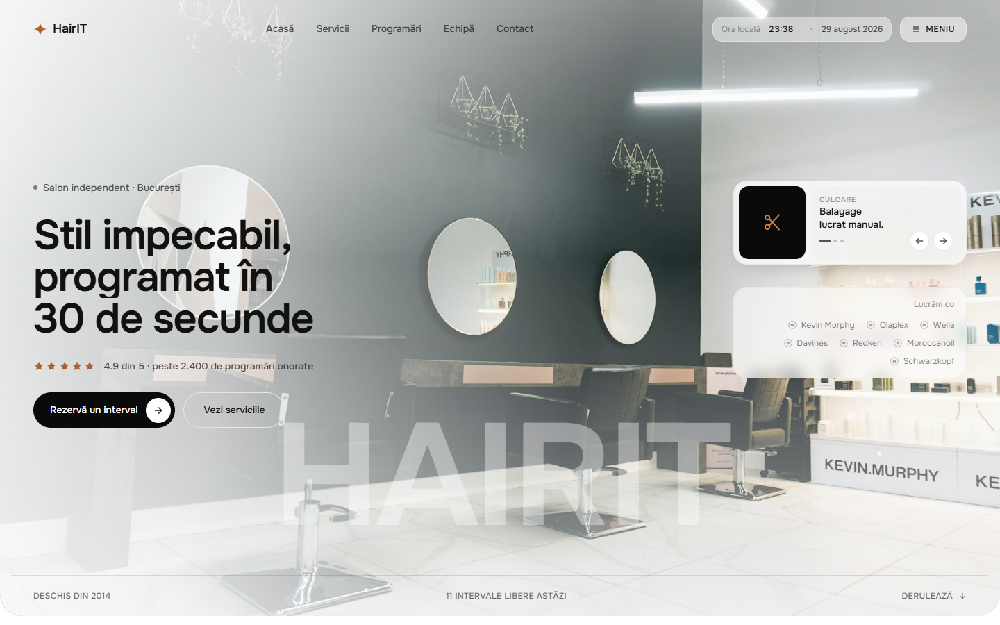

> **Pe scurt:** calendar pe 12 zile → alegi un interval liber (verde) → completezi formularul →
> statusul trece în `booked` și lista, calendarul și statisticile se actualizează instant.
> Build de producție: **80,8 kB** transferați, fără niciun framework CSS.

---

## Cuprins

- [Funcționalități](#funcționalități)
- [Capturi de ecran](#capturi-de-ecran)
- [Tehnologii](#tehnologii)
- [Structura proiectului](#structura-proiectului)
- [Pornire rapidă](#pornire-rapidă)
- [API](#api)
- [Sistemul de design](#sistemul-de-design)
- [Cerințele temei și unde sunt implementate](#cerințele-temei-și-unde-sunt-implementate)
- [Scripturi disponibile](#scripturi-disponibile)
- [Publicare pe Vercel](#publicare-pe-vercel)

---

## Funcționalități

**Programări**

- calendar orizontal cu 12 zile, fiecare zi arătând câte intervale sunt libere;
- lista intervalelor pentru ziua selectată, generată dinamic cu `*ngFor`;
- intervalele libere sunt verzi, cele ocupate sunt roșii (`[ngClass]` pe baza statusului);
- filtre **Toate / Libere / Ocupate** și legendă de culori;
- la clic pe un interval se afișează panoul de detalii (client, telefon, dată și oră, serviciu, stilist);
- când nu este selectat nimic, panoul afișează mesajul *„Selectează o programare pentru a vedea detaliile”*;
- intervalele libere pot fi rezervate printr-un formular reactiv cu validări;
- după rezervare statusul trece din `available` în `booked`, iar lista, calendarul și statisticile se actualizează;
- pentru un interval ocupat butonul de rezervare nu este afișat, ci un mesaj de indisponibilitate și opțiunea de eliberare.

**Prezentare**

- ecran de intrare care numără `000 → 100` și eliberează pagina;
- hero cu imagine full-bleed și efect *liquid reveal*: a doua fotografie este pictată pe traseul cursorului;
- listă de servicii citită din API, cu durată, preț și categorie;
- secțiune editorială despre salon, echipa în carduri întunecate, panou cu cifrele salonului;
- meniu pe tot ecranul, formular modal de contact, footer cu date de contact;
- scroll fluid (Lenis), animații de intrare la derulare și layout responsive.

---

## Capturi de ecran

| Ecran de intrare | Servicii |
| --- | --- |
| 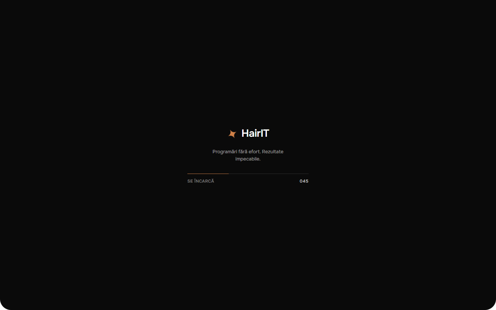 | 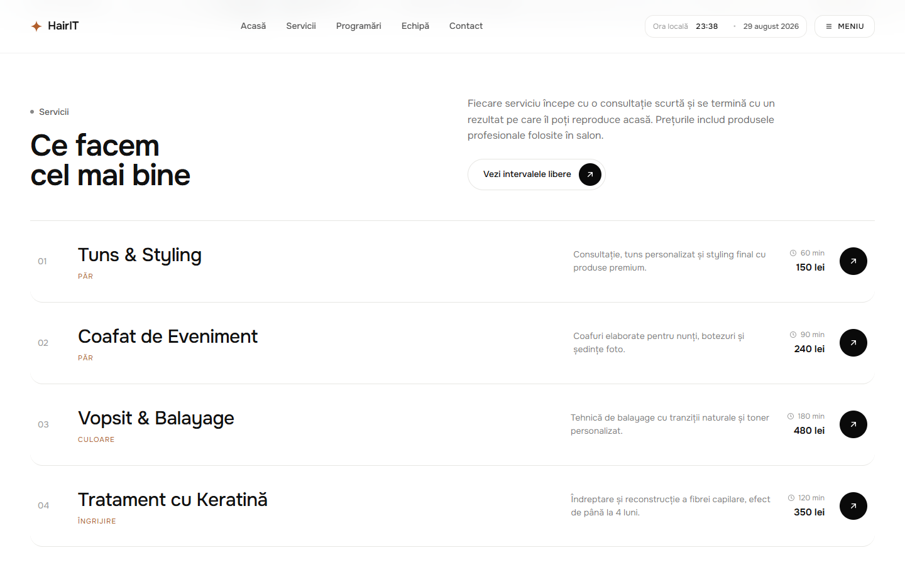 |

| Lista de programări | Detalii și rezervare |
| --- | --- |
| 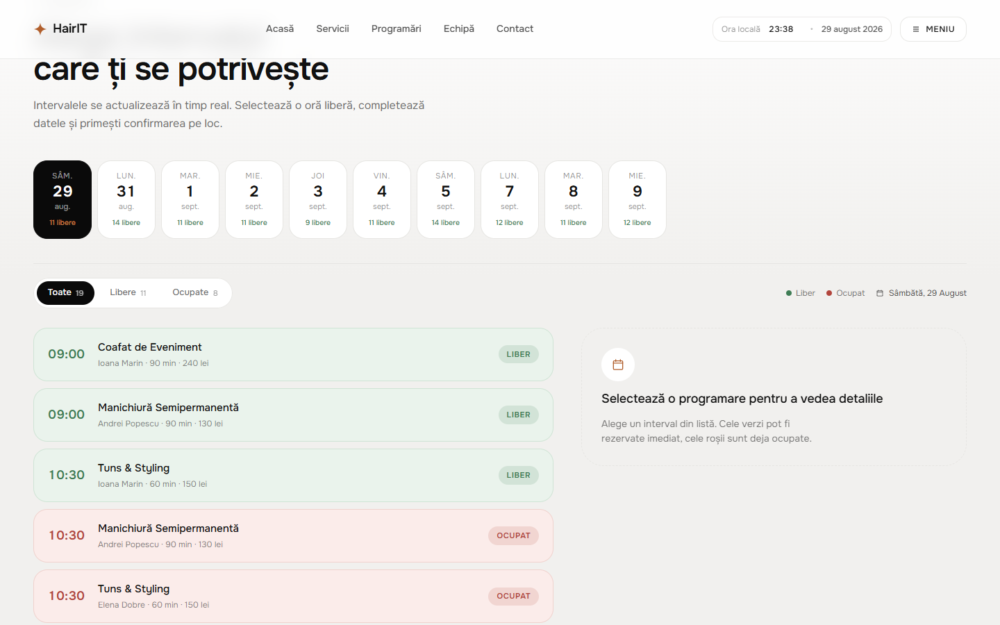 | 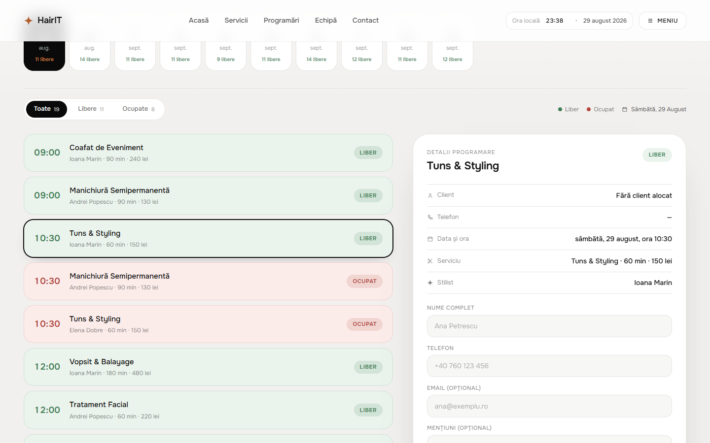 |

| Despre salon | Echipa |
| --- | --- |
| 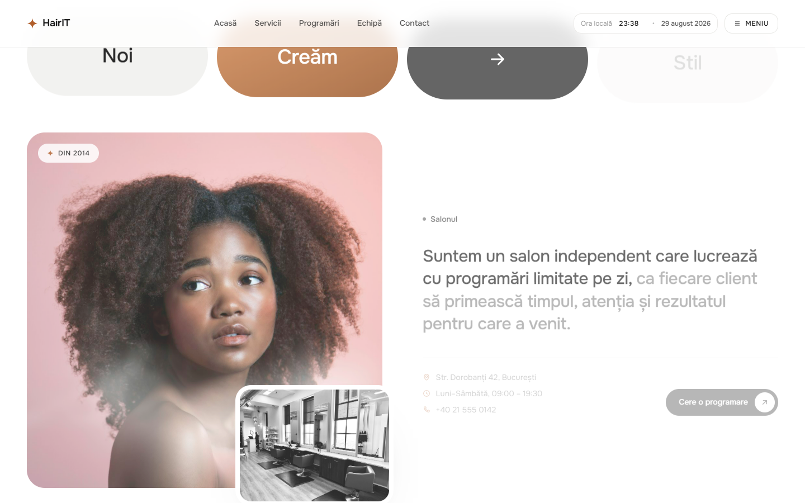 | 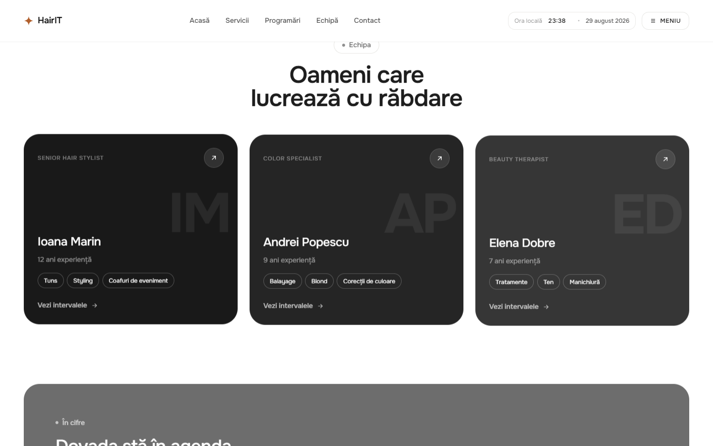 |

| Cifrele salonului | Footer |
| --- | --- |
| 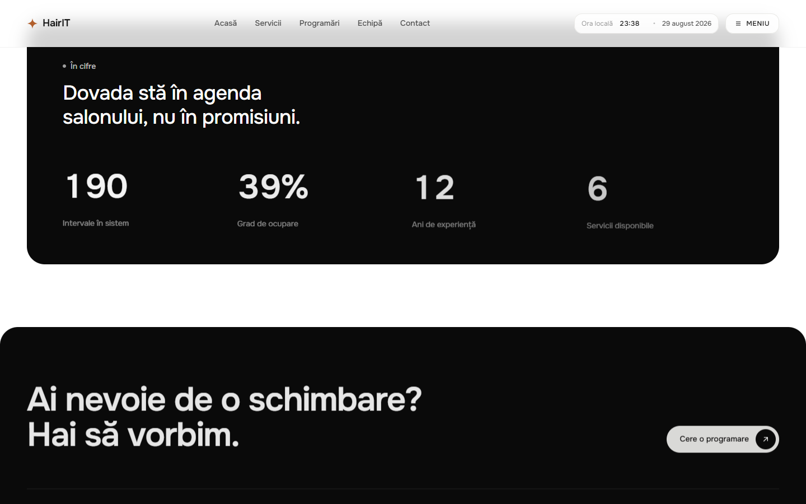 | 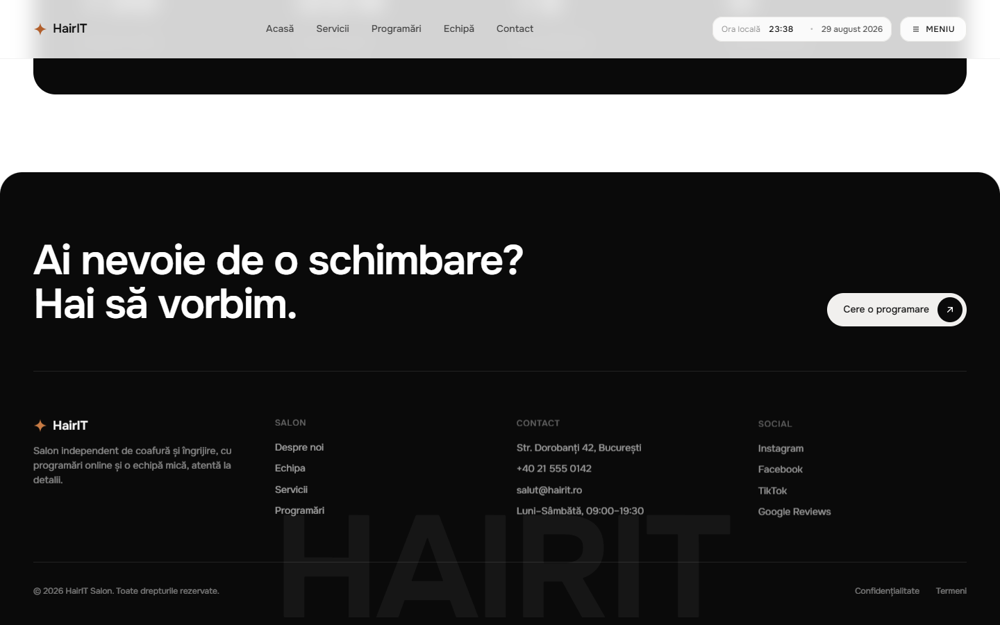 |

| Meniu | Formular de contact | Mobil |
| --- | --- | --- |
| 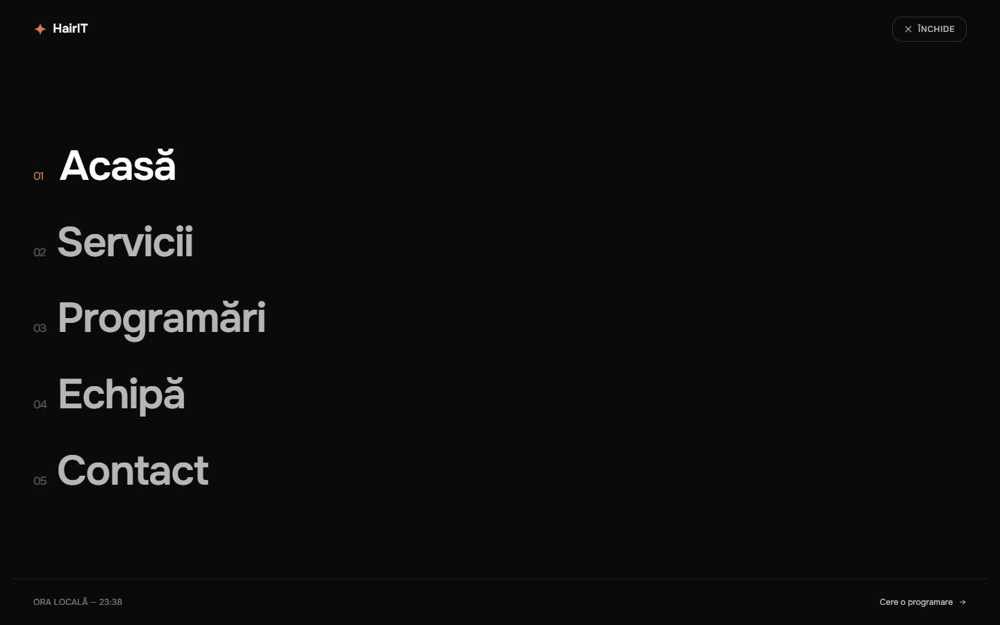 | 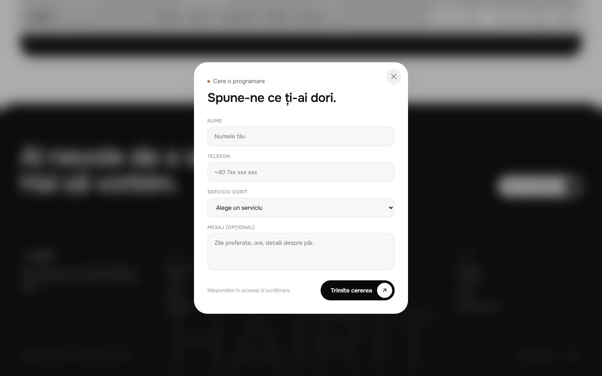 | 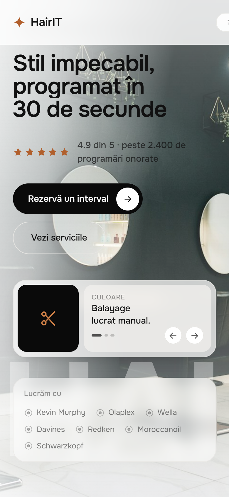 |

Capturile se regenerează cu `npm run screenshots` (necesită Chrome sau Edge instalat,
plus backend-ul și frontend-ul pornite).

---

## Tehnologii

| Zonă | Tehnologii |
| --- | --- |
| Frontend | Angular 21 (componente standalone, signals, zoneless), TypeScript 5.9, CSS pur, Lenis |
| Backend | Node.js 24, Express 4, `node:sqlite` local și `@libsql/client` (Turso) în producție |
| Găzduire | Vercel — frontend static + API ca funcție serverless |
| Unelte | Angular CLI, Puppeteer (capturi de ecran), PowerShell / zip (arhiva de predare) |

Nu există dependențe de UI kit-uri sau framework-uri CSS: tot sistemul de design este scris de mână.

---

## Structura proiectului

```
HairIT/
├── backend/                    API REST + baza de date
│   └── src/
│       ├── lib/db.js           conexiunea SQLite și schema
│       ├── lib/repository.js   interogările pregătite
│       ├── routes/api.js       rutele REST și validările
│       ├── seed.js             datele de test (servicii, stiliști, intervale)
│       ├── app.js              configurarea Express
│       └── server.js           punctul de pornire
├── frontend/                   aplicația Angular
│   ├── public/images/          fotografiile folosite în pagină
│   └── src/app/
│       ├── core/
│       │   ├── models/         interfețele TypeScript
│       │   ├── services/       AppointmentApi, BookingStore, UiState, Clock, SmoothScroll
│       │   └── utils/          formatarea datelor și a prețurilor
│       ├── shared/             pictograme SVG, directiva de reveal, efectul liquid
│       ├── components/
│       │   ├── page-loader/    ecranul de intrare
│       │   ├── site-header/    bara de navigare
│       │   ├── nav-menu/       meniul pe tot ecranul
│       │   ├── hero-section/   secțiunea principală
│       │   ├── services-section/
│       │   ├── booking-section/ containerul de programări
│       │   ├── term-card/      un interval din listă
│       │   ├── term-details/   detaliile + formularul de rezervare
│       │   ├── studio-section/
│       │   ├── team-section/
│       │   ├── stats-section/
│       │   ├── site-footer/
│       │   └── request-modal/  formularul de contact
│       ├── app.ts / app.html   componenta rădăcină
│       └── styles.css          sistemul de design global
├── api/index.js                punctul de intrare pentru funcția serverless de pe Vercel
├── vercel.json                 comenzile de build și rutarea /api către funcție
├── docs/screenshots/           capturile din acest README
└── tools/                      generarea capturilor și arhiva de predare
```

Fiecare componentă are fișiere separate pentru clasă (`.ts`), șablon (`.html`) și stiluri (`.css`).

---

## Pornire rapidă

Ai nevoie de **Node.js 22.12+ sau 24+** (aplicația a fost dezvoltată pe Node 24).

```bash
npm run setup
```

Pornește API-ul într-un terminal:

```bash
npm run api
```

Și aplicația Angular în alt terminal:

```bash
npm run web
```

- interfața: <http://localhost:4200>
- API: <http://localhost:3100/api>

Baza de date SQLite se creează și se populează automat la prima pornire a serverului,
în `backend/data/hairit.db`. Nu ai nevoie de niciun cont sau variabilă de mediu pentru dezvoltare.
Pentru a regenera datele de test:

```bash
npm run seed
```

Serverul de development Angular trimite cererile `/api` către backend prin `frontend/proxy.conf.json`,
deci nu ai nevoie de configurări suplimentare.

---

## API

Toate rutele sunt sub prefixul `/api`.

| Metodă | Rută | Descriere |
| --- | --- | --- |
| `GET` | `/health` | verificarea stării serverului |
| `GET` | `/services` | lista serviciilor |
| `GET` | `/stylists` | lista stiliștilor |
| `GET` | `/stats` | totaluri, grad de ocupare, încasări estimate |
| `GET` | `/appointments` | programările; filtre opționale `date`, `status`, `serviceId` |
| `GET` | `/appointments/days` | zilele disponibile, cu numărul de intervale libere și ocupate |
| `GET` | `/appointments/:id` | o programare |
| `POST` | `/appointments` | adaugă un interval nou (`date`, `time`, `serviceId`, `stylistId`) |
| `POST` | `/appointments/:id/reserve` | rezervă intervalul (`clientName`, `phone`, opțional `email`, `notes`) |
| `POST` | `/appointments/:id/cancel` | eliberează intervalul |

Exemplu de răspuns pentru o programare:

```json
{
  "id": 12,
  "date": "2026-08-31",
  "time": "10:30",
  "status": "booked",
  "clientName": "Ana Petrescu",
  "phone": "+40760123456",
  "email": "ana@example.com",
  "notes": "",
  "serviceId": 1,
  "service": "Tuns & Styling",
  "category": "Păr",
  "durationMin": 60,
  "price": 150,
  "stylistId": 1,
  "stylist": "Ioana Marin",
  "stylistInitials": "IM"
}
```

Coduri de eroare folosite: `400` parametri invalizi, `404` programare inexistentă,
`409` interval deja rezervat sau deja liber, `422` date de formular invalide.

---

## Sistemul de design

| Rol | Culoare |
| --- | --- |
| Fundal / text | `#ffffff` / `#111111` |
| Suprafețe | `#f1f0ee`, `#e3e2df`, linii `#e6e5e2` |
| Carduri închise | `#0a0a0a` |
| Accent | `#b15f2c`, gradient `#cf8047 → #97501f` |
| Interval liber | `#3f7d55` pe fundal `#eaf3ec` |
| Interval ocupat | `#b2453c` pe fundal `#fbecea` |

- tipografie: **Onest** (400/500/600/700);
- toate dimensiunile sunt în `rem`, iar `font-size`-ul rădăcinii urmează lățimea ecranului
  (`0.833vw` la 1920px, `1.111vw` la 1440px, `1.5625vw` la 1024px, `4.44vw` sub 640px),
  astfel încât proporțiile rămân identice pe orice ecran;
- animațiile respectă `prefers-reduced-motion`.

---

## Cerințele temei și unde sunt implementate

| Cerință | Implementare |
| --- | --- |
| Componenta principală a aplicației | `frontend/src/app/app.ts` + secțiunile din `components/` |
| Listă de programări cu nume, telefon, dată, oră, serviciu, status | modelul `Appointment` din `core/models/appointment.ts`, datele vin din API |
| Afișarea tuturor programărilor cu `*ngFor` | `components/booking-section/booking-section.html` |
| `ngClass` pentru diferențierea vizuală (verde / roșu) | `components/term-card/term-card.html` + `term-card.css` |
| Clic pe o programare liberă → se poate rezerva | `BookingStore.selectTerm()` și formularul din `term-details` |
| Clic pe o programare ocupată → mesaj de indisponibilitate | `BookingStore.selectTerm()` setează `notice`, afișat în `term-details.html` |
| Event binding `(click)="selectTerm(term)"` | `booking-section.html`, prin `(choose)` emis de `TermCard` |
| `selectedTerm` inițial `null` și afișarea detaliilor | `BookingStore.selectedTerm` este `signal<Appointment \| null>(null)` |
| `*ngIf` pentru detalii și pentru mesajul implicit | `components/term-details/term-details.html` |
| Buton „Reserve” care schimbă statusul în `booked` | `TermDetails.submit()` → `BookingStore.reserve()` → `POST /appointments/:id/reserve` |
| Butonul nu apare pentru programările rezervate | `*ngIf="selected.status === 'available'"` în `term-details.html` |
| Stilizarea aplicației | `frontend/src/styles.css` și fișierele `.css` ale fiecărei componente |

---

## Scripturi disponibile

| Comandă | Efect |
| --- | --- |
| `npm run setup` | instalează dependențele (rădăcină + frontend) |
| `npm run api` | pornește API-ul pe portul 3100, cu reîncărcare la salvare |
| `npm run web` | pornește aplicația Angular pe portul 4200 |
| `npm run build` | build de producție pentru frontend |
| `npm run seed` | regenerează datele de test în baza locală |
| `npm run seed:turso` | regenerează datele în baza Turso, citind `.env` |
| `npm run screenshots` | regenerează capturile din `docs/screenshots` |
| `npm run livrabil` | creează arhiva `andrei_stoian_assignment06.zip` pentru predare |

---

## Publicare pe Vercel

Aplicația rulează pe Vercel ca un singur proiect: frontendul Angular este livrat static de CDN,
iar API-ul Express devine o funcție serverless (`api/index.js`), conform `vercel.json`.

Funcțiile serverless au filesystem read-only, deci în producție baza de date nu poate sta pe disc.
Stratul de acces la date alege singur driverul:

| Mediu | Driver | Unde stau datele |
| --- | --- | --- |
| local (fără variabile de mediu) | `node:sqlite` | `backend/data/hairit.db` |
| producție (`TURSO_DATABASE_URL` setat) | `@libsql/client/web` | [Turso](https://turso.tech) — SQLite găzduit |

Interogările SQL sunt identice în ambele cazuri.

### Pașii de publicare

1. **Creează baza pe Turso** (cont gratuit):

   ```bash
   turso db create hairit
   turso db show hairit --url
   turso db tokens create hairit
   ```

2. **Populează baza o singură dată**, de pe calculatorul tău — copiază `.env.example` în `.env`,
   completează cele două valori, apoi:

   ```bash
   npm run seed:turso
   ```

3. **Importă proiectul în Vercel** și adaugă în *Settings → Environment Variables*:
   `TURSO_DATABASE_URL` și `TURSO_AUTH_TOKEN` (pentru Production și Preview).

4. **Deploy.** Vercel folosește comenzile din `vercel.json`, deci nu trebuie să configurezi nimic
   în interfață. Frontendul apelează `/api`, aceeași origine, deci nu există probleme de CORS.

Pentru a reface datele demo pe baza publicată, rulează din nou `npm run seed:turso`.

---

## Livrare

```bash
npm run livrabil
```

Arhiva rezultată (~4 MB) conține codul sursă fără `node_modules`, `dist` sau baza de date locală.
După dezarhivare este suficient `npm run setup`, apoi `npm run api` și `npm run web`.

---

Fotografiile din `frontend/public/images` provin de pe [Unsplash](https://unsplash.com) și sunt folosite
în scop demonstrativ.
